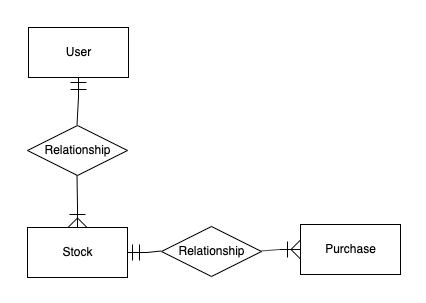
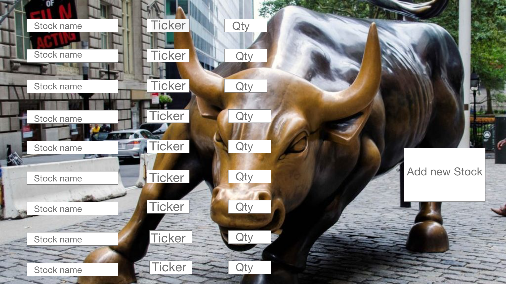
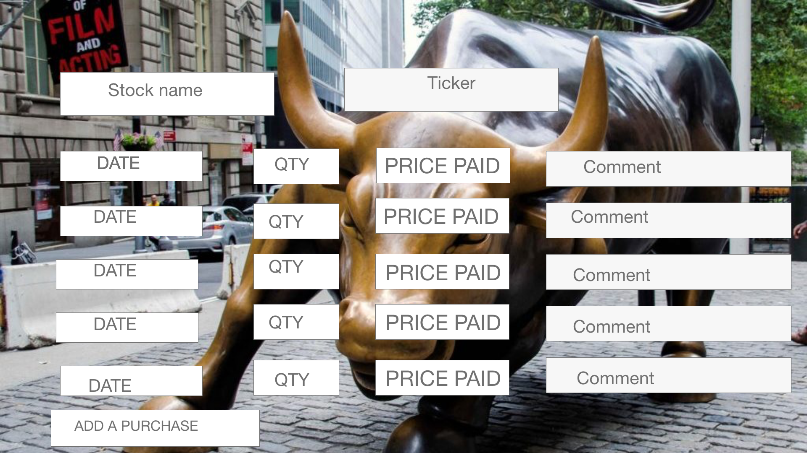
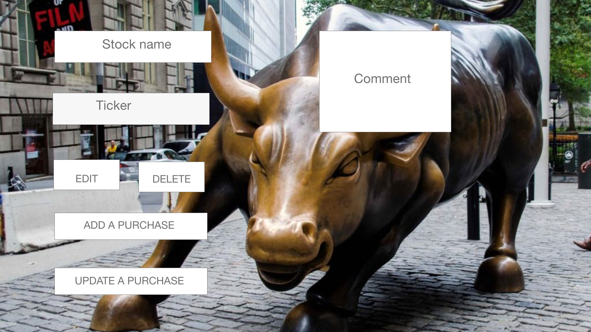
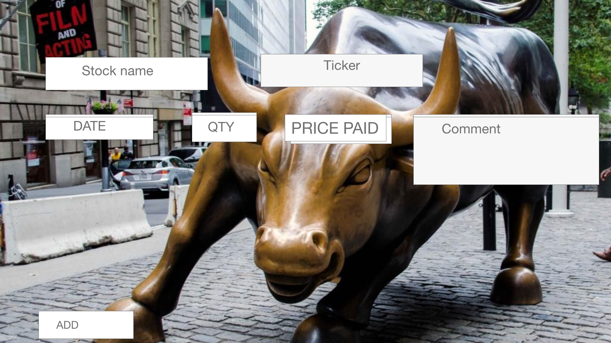
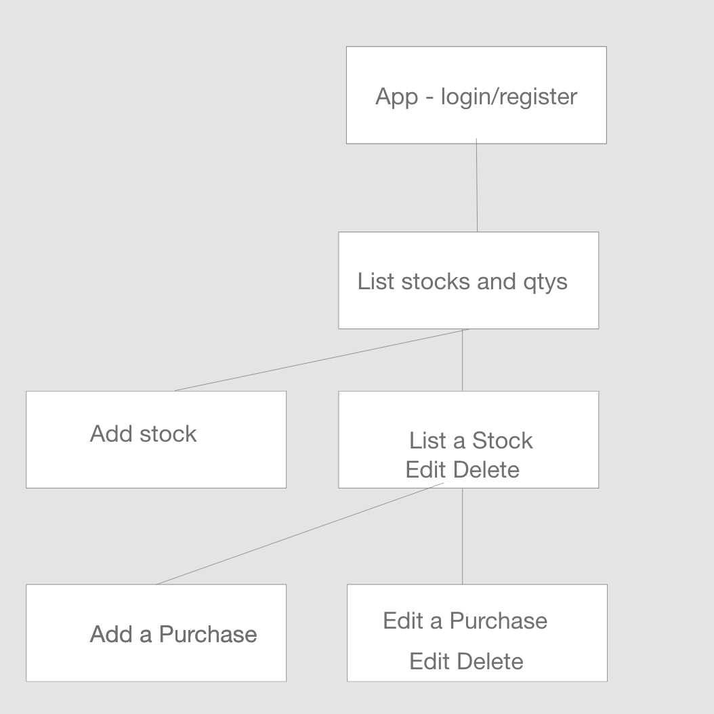
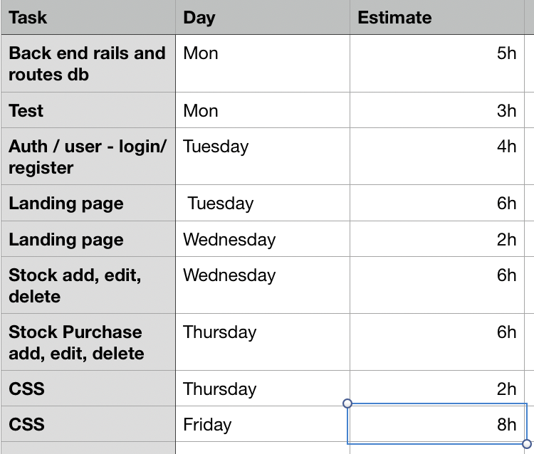

# stockpurchases
**Project Description**

*PURPOSE:*

Is an application that will for each user track each stock they purchases and track the purchase date and price.

*CHALLENGES*

time, Date logic, 

post mvp auth refactor

*MVP:*

user register/login

display all stocks for a user and total number of shares
add, update delete a stock
add, update,delete a purchase

*POST MVP:*

add call to third party for current price of stock and show value of each purchase maybe gain loss

auth that will timeout in 15 min if no activity

delete user

**ERD:**

**WIREFRAMES:**

**React Component Heirarchy:**

**API Endpoint Documentations:**
 WIP

**List Dependencies:**

post MVP third party for current value of stock

**Installation instructions:**
bundle
cd client
npx install
npm install axios react-router-dom

**Technologies Used:**
postgress,
ruby,  rails,
axios.
react,
Java Script,
CSS

**Additional Libraries:**
None

**Timeframes:**

